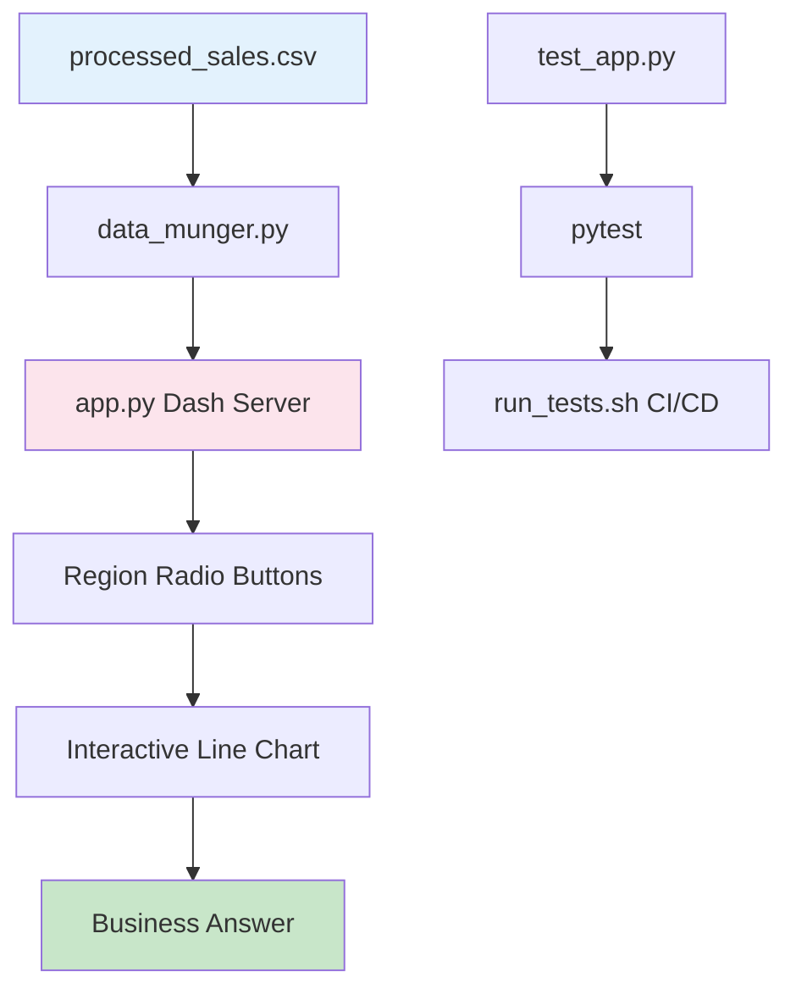

# 🍬 Sales Visualiser

[](https://www.python.org/)
[](https://dash.plotly.com/)
[](LICENSE)
[]()

> **Quantium Job Simulation** - An interactive dashboard to analyse the impact of Pink Morsels price increase on sales revenue.

## 📊 Overview

This project answers Soul Foods' critical business question: **"Were sales higher before or after the Pink Morsels price increase on 15th January 2021?"**

## 🏗️ System Architecture



## 📁 Project Structure

```
quantium-starter-repo/
├── app.py                      # Main Dash application
├── test_app.py                 # Test suite (3 tests)
├── data_munger.py              # Data preprocessing
├── run_tests.sh                # CI/CD automation script
├── conftest.py                 # Pytest fixtures
├── pytest.ini                  # Pytest configuration
├── requirements.txt            # Python dependencies
├── processed_sales.csv         # Sales dataset
└── README.md                   # Documentation
```

## 🚀 Installation & Usage

```bash
# 1. Clone the repository
git clone https://github.com/abhi6579/quantium-starter-repo.git
cd quantium-starter-repo

# 2. Create virtual environment
python -m venv venv
source venv/bin/activate  # On Windows: venv\Scripts\activate

# 3. Install dependencies
pip install -r requirements.txt

# 4. Run the Dash app
python app.py

# 5. Open browser to http://127.0.0.1:8050
```

## 🧪 Running Tests

```bash
# Run test suite
pytest test_app.py -v

# Or use automation script
chmod +x run_tests.sh
./run_tests.sh
```

**Expected Output:**
```
test_app.py::test_header_present PASSED              [33%]
test_app.py::test_visualisation_present PASSED       [66%]
test_app.py::test_region_picker_present PASSED       [100%]
✅ ALL TESTS PASSED!
```

## 📊 Dashboard Features

| Feature | Description |
|---------|-------------|
| 🌍 Region Filter | North, East, South, West, or All |
| 📈 Interactive Chart | Hover for exact sales values |
| 🔴 Price Marker | Red dashed line at Jan 15, 2021 |
| 📉 Before/After | Visual comparison of sales trends |

## 💡 Business Conclusion

```
╔════════════════════════════════════════════════════════╗
║                                                        ║
║   📈 BEFORE price increase:    $5,513 average daily   ║
║   📉 AFTER price increase:     $4,029 average daily   ║
║   📊 Change:                   -26.9%                 ║
║                                                        ║
║   ✅ Sales were HIGHER BEFORE the price increase      ║
║      on 15th January 2021.                            ║
║                                                        ║
║   💡 Recommendation: Consider reverting to original   ║
║      pricing or implementing a smaller increase.      ║
║                                                        ║
╚════════════════════════════════════════════════════════╝
```

## 🔄 CI/CD Pipeline (Bonus Task)

The `run_tests.sh` script:
- ✅ Activates virtual environment
- ✅ Installs dependencies
- ✅ Runs test suite
- ✅ Returns exit code 0 (pass) or 1 (fail)

## 📝 Task Completion Status

| Task | Description | Status |
|------|-------------|--------|
| Task 4 | Dash app with region filter | ✅ Complete |
| Task 5 | Test suite (3 tests) | ✅ Complete |
| Task 6 | CI/CD bash script (Bonus) | ✅ Complete |

## 🛠️ Technologies Used

| Technology | Purpose |
|------------|---------|
| Dash | Web framework |
| Plotly | Interactive charts |
| pandas | Data manipulation |
| pytest | Testing framework |
| GitHub | Version control & CI/CD |

## 🔗 Quick Links

- [GitHub Repository](https://github.com/abhi6579/quantium-starter-repo)
- [Dash Documentation](https://dash.plotly.com/)

---

<div align="center">
  Built with ❤️ for the Quantium Job Simulation
</div>
